# Training a Convolutional Neural Network (CNN) to Detect Flooding Damage

---------------------------------------------

## The Problem

According to the [Congressional Budget office](https://www.cbo.gov/publication/55360#:~:text=CBO%20estimates%20that%20expected%20annual,related%20flooding%20totals%20%2417%20billion.), economic losses due to storm surges, hurricane winds, and heavy precipitation are estimated to be around $54 billion annually.

After natural distasters like hurricanes, insurance companies are tasked with inspecting property for potential damage, confering with claimants, and determining the amount of money to be paid out.

The overall goal of this project is to build, train, and modify various CNNs to accurately classify satelite images as either including flooding damage or no flooding damage.

-----------------------------------------------

## The Data

[link to data](https://www.kaggle.com/kmader/satellite-images-of-hurricane-damage)

* The dataset used in my project conains satellite images of Texas after Hurrican Harvey. The images are divided into two classes: `damage` and `no_damage`
  * train_another: the training data contains 10000 images (5000 of each class)
  * validation_another: the validation data contains 2000 images (1000 of each class)
  * test_another: this is unbalanced test data with 8000 images of damaged properties and 1000 images of undamaged property
  * test: this directory contains 2000 images (1000 of each class)

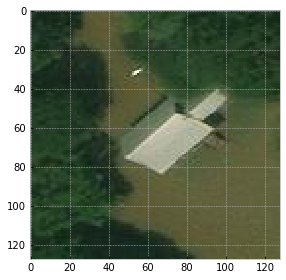

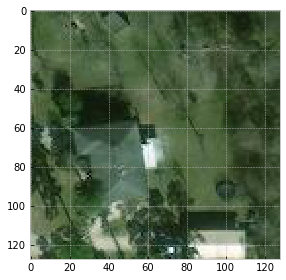

### Can you tell the difference?

* The first image contains flooding damage, and the second does not. At a first glance, my eyes can't tell the difference. It will be interesting to see if a computer can (more on that later).

-------------------------------------------------

## Model Selection

The data were trained on three different CNN architectures: A somewhat basic CNN with roughly two million trainable parameters, An AlexNet CNN architecture with roughly 47 million trainable parameters, and a ResNet-34 CNN architecture with roughly 21 million parameters

---------------------------------------------

## Model 1:

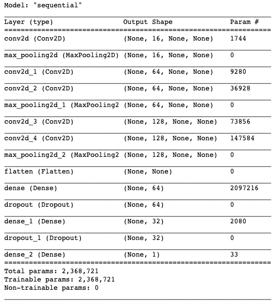

This model contains five convolution layers, three max pooling layers, two dropout layers, and three dense layers. I went with this model architecture to start because the trainable parameters are on the lower end, meaning there isn't a degree of computational overhaul that would overwhelm my local machine.

ReLu activation functions used for the hidden layers, and the output layer uses a Sigmoid function because we're building a binary classifier. 

### Performance:

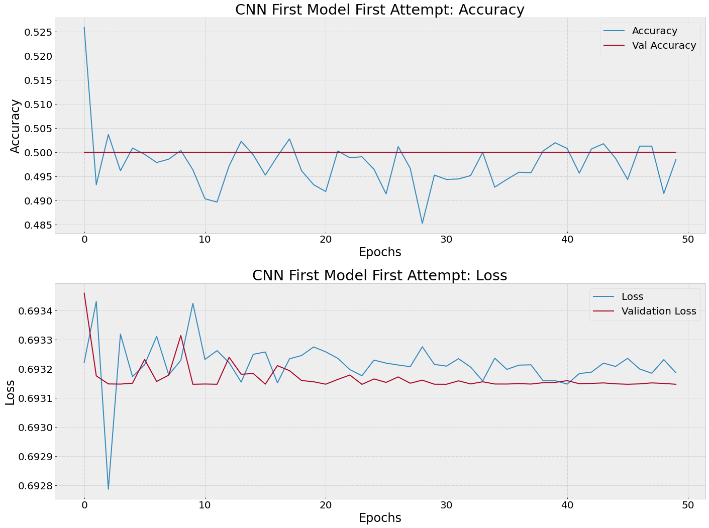

This model was not able to classify images accurately as evidenced by the validation accuracy. The model is essentially randomly guessing and picking the same class every time. Similarly, validation loss is not decreasing as one would expect in a model that is able to differentiate between classes. 

Is there a chance that, like me, a computer won't be able to tell the difference between damaged and not damaged images? Absolutely. Will that stop me from building and trying out other models? Absolutely not!

-------------------------------------------------

## AlexNet:

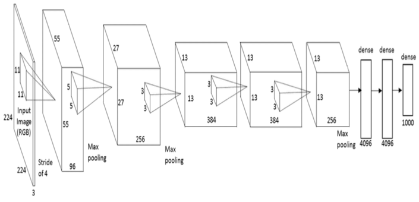

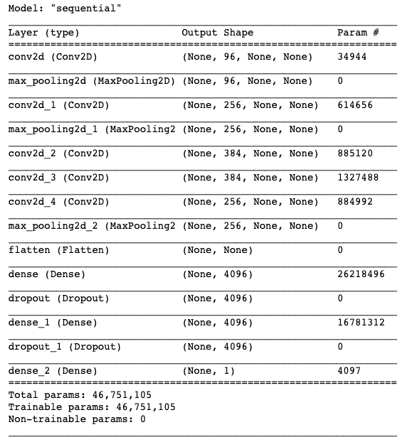

As seen above, the Alexnet artitechure contains five convolutional layers, three max pooling layers, three dense layers, and two dropout layers. I used ReLu activation for all hidden layers, and, similar to my first CNN, used a Sigmoid function for the output layer.

Training once with AlexNet yielded results that were very similar to my first model; it was also random guessing.

After tuning various hyperparameters, I found decreasing the learning rate of my optimizer (Adam) to 0.0001 yielded some promising results:

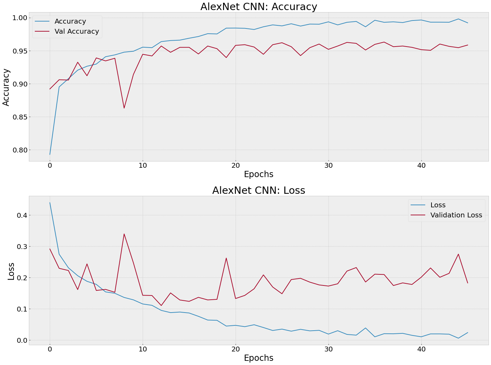

* We're seeing a validation accuracy of 0.95 and a loss (binary crossentropy) of 0.18.

---------------------------------

## ResNet-34:

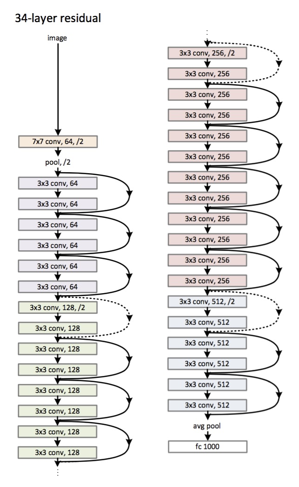

The most notable difference between ReNet-34 and other CNNs is the use of a residual block. In CNNs with residual blocks, each layer feeds into the next as well as layers 2-3 steps down.

This is how I built it out:

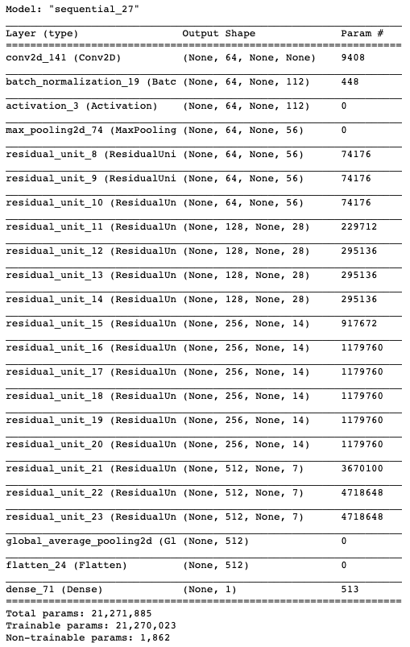

I trained the data on this model using both the default learning rate for the Adam optimizer (0.001) as well as the smaller one used for AlexNet (0.0001).

* Validation Accuracy: 0.69
* Loss: 1.4

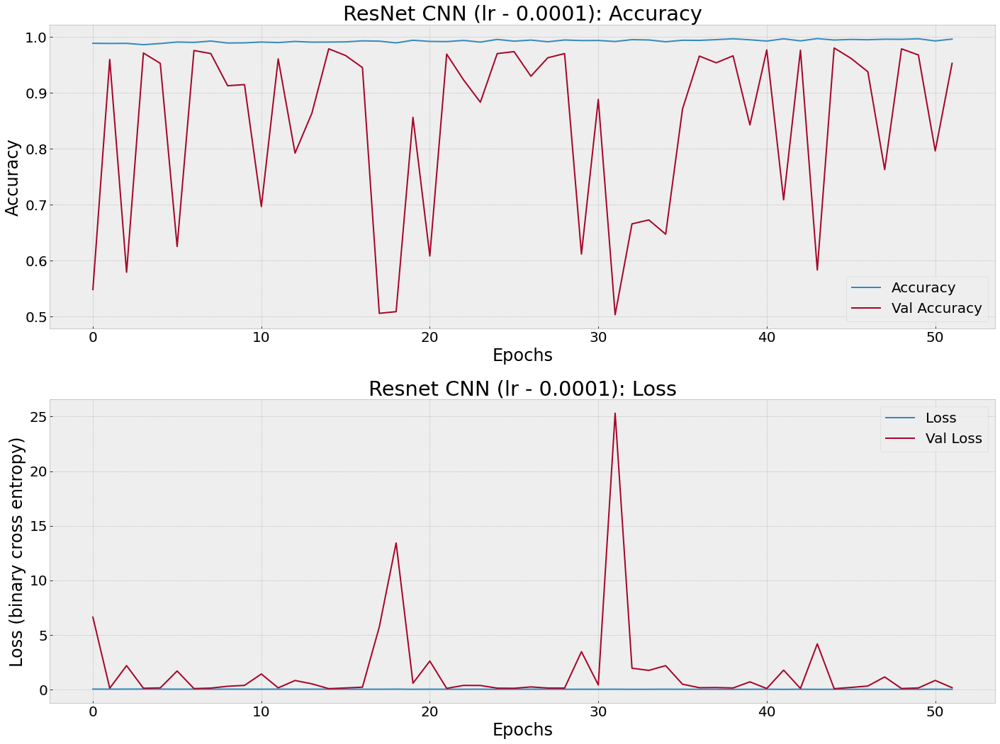

* Validation Accuracy: 0.95
* Loss: 0.16

Both seem to be performing similarly, yielding very inconsistent validation accuracy and loss scores. It seems like this model is overfitting on the training data as evidenced by the consistently high test accuracy and low loss.

### Here are the two variants of the model on top of each other:

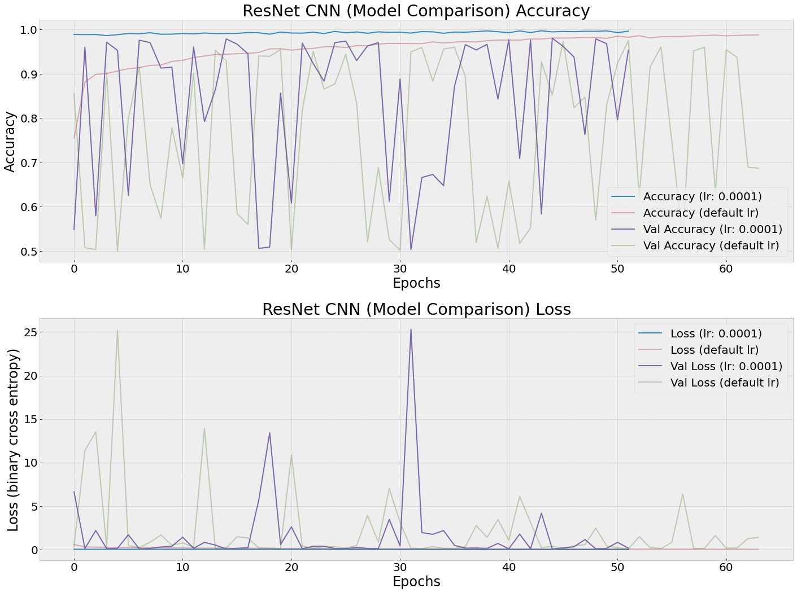

---------------------------------

## Conclusions:

It appears that the AlexNet CNN architecture performed the best in being able to differentiate classes in the validation data. 

* It also performed accurately when making predictions on holdout data:

  * Predicting Flood Damage:

  

  * Predicting No Flood Damage:

  

Though ResNet did not perform as well as I hoped, I'm confident additional hyperparameter tuning could yield better results.

## Future Considerations:

* Trying additional CNN architectures
* Applying transferlearning to this dataset
* Trying non CNN models to investigate how the hold up against these more cutting-edge models.

